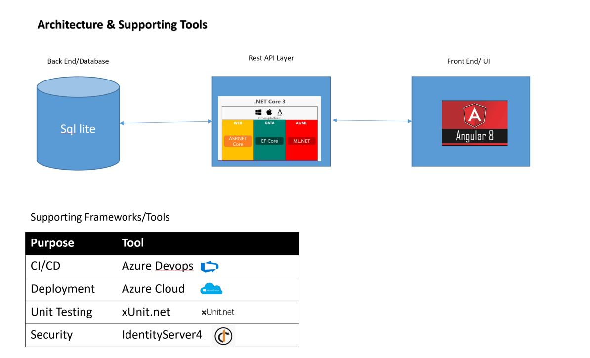

# PerchedPeacockSkillenza
  An end to end application for a parking solution company. The applications provides a secured and scalable solution for a parking solution provider. The key features of this application are finding a free parking and keep track of booking history. It is easily extensible to include features such as payment gateways and third party oAuth logins. The application is built using the latest cutting edge technologies available in the market.  It is cloud friendly and can be easily deployed in any public clouds such as azure and aws. A complete CI/CD pipeline is also attached to the solution.  

# Technical Stack

  | Front End | Service Layer | Database| 
  |-----------|:-------------:|:--------|
  | Angular 8  | Asp.net Core 3 Web API|SQLLite Database |  
  
 ## Prerequisite 
  Developer should have below softwares installed on the dev server to execute this project  
    VS 2019  
    Node 10.9 +  
    Npm 6 + 
  
  ### Other Frameworks Used 
  1. xUnit.net - For Unit testing 
    xUnit.net is a free, open source, community-focused unit testing tool for the .NET Framework.
  2. Microsoft Identity4 - For Authentication & Authorization (IdentityServer4 is an OpenID Connect and OAuth 2.0 framework for ASP.NET Core)
  3.  Swashbuckle swagger - For API documentation  
      * Swashbuckle.AspNetCore.Swagger: a Swagger object model and middleware to expose SwaggerDocument objects as JSON endpoints.

      * Swashbuckle.AspNetCore.SwaggerGen: a Swagger generator that builds SwaggerDocument objects directly from your routes, controllers,    and models. It's typically combined with the Swagger endpoint middleware to automatically expose Swagger JSON.

      * Swashbuckle.AspNetCore.SwaggerUI: an embedded version of the Swagger UI tool. It interprets Swagger JSON to build a rich, customizable        experience for describing the web API functionality. It includes built-in test harnesses for the public methods.
   
  ## Project Implementation details 
   
  
  ## Solution Key items
     1. PerchedPeacockWebApplication.csproj 
        This project contains the rest api's and business logic for the perched peacock application
        The project has a folder called ClientApp. This folder contains the front end part of the application
        
        
  ## API Design 
      Controllers 
      1.  Bookings controller - The booking controller has the methods for managing parking lot bookings. Key operations are Post a booking, find free slots and get booking. 
      2.  Parking lot controller - The parking lot controller will take care of managing parking lot referential. key operations are adding a parking lot and removing a parking lot. 
      3.  location controller - The location controller is a referential for all parking lot locations. 
      
   # CI/ CD
   Builds 
   https://dev.azure.com/remyarajan843/PerchedPeacokNewProj/_build?definitionId=1 
     
  Test reports
  https://dev.azure.com/remyarajan843/PerchedPeacokNewProj/_build/results?buildId=9&view=ms.vss-test-web.build-test-results-tab
     
  Code coverage 
  https://dev.azure.com/remyarajan843/PerchedPeacokNewProj/_build/results?buildId=9&view=codecoverage-tab 
     
  Release pipeline
  https://dev.azure.com/remyarajan843/PerchedPeacokNewProj/_releaseProgress?_a=release-pipeline-progress&releaseId=9
     
  nuget
  https://www.nuget.org/packages/PerchedPeacockWebApplication/
  
  # Deployment 
  The application can be deployed in windows/ linux server. 
   The system should have Node 10.9, Npm 6 + and dotnet core 3.0 runtime. As of now azure and aws cloud has partial support for dot net core.   https://aspnetcoreon.azurewebsites.net/#ASP.NET%20Core%20Module 
A deployement is pushed to https://renjithperchedpeacock.azurewebsites.net . Waiting for Azure support for dotnet core 3. 
